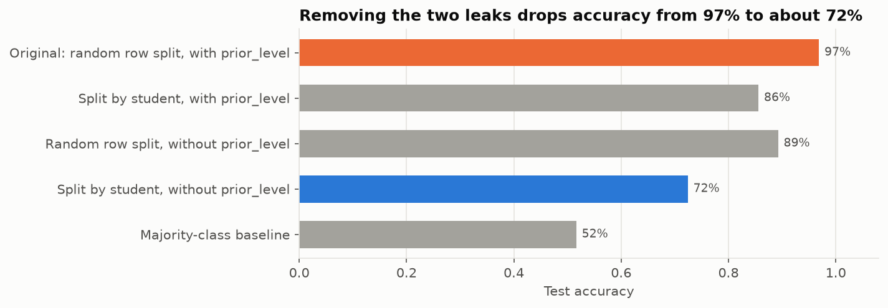
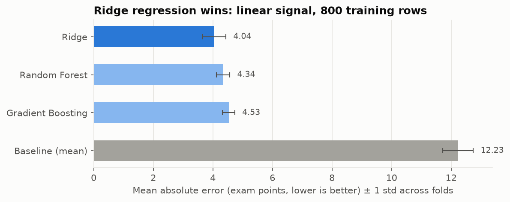
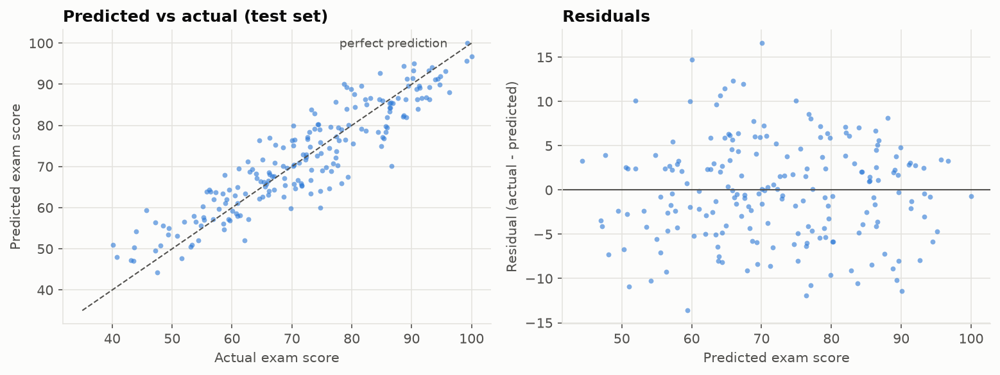

# AutoLearn: adaptive learning platform with exam-score prediction

A full-stack learning platform for AI/ML students: it turns a free-text syllabus into an ordered learning path, assesses the learner with an adaptive quiz, **predicts their expected exam score and level with a machine-learning model**, and recommends videos, courses and projects.

This repository focuses on the **data science side**: data quality audit, leakage detection, model selection and honest evaluation, then integration of the model into a Flask API consumed by a React frontend.

## Key results

| | |
|---|---|
| **Leakage found and fixed** | The first version reported **97% accuracy**. It came from a target-derived feature and the same students appearing in train and test. With both removed, that setup falls to **72%**. |
| **Final model** | Ridge regression on 11 student features, chosen by 5-fold cross-validation among Ridge, Random Forest and Gradient Boosting |
| **Test performance** (200 unseen students) | **MAE = 4.5 exam points, R² = 0.84**, vs MAE = 11.4 for a mean baseline |
| **Learner level** (derived from the score) | 80% accuracy, macro-F1 = 0.71. Errors happen only between adjacent levels |
| **Main drivers** | Previous score (dominant), daily study time, motivation (+), exam anxiety (−) |



## Business problem

When a learner joins, the platform knows almost nothing about them. To adapt the learning path, we want to estimate **how well they would perform on an exam**, and therefore whether to treat them as a *beginner* (< 50), *intermediate* (50–75) or *advanced* (≥ 75) learner.

## Data

| File | Grain | Content |
|---|---|---|
| `data/raw/student_performance.csv` | 1,000 students | Exam score, previous score, study habits, attendance, homework, sleep, motivation, anxiety, parental education, study environment |
| `data/raw/learning_interactions.csv` | 9,000 sessions (300 students × 30) | Session logs: time spent, video completion, quiz scores… |
| `data/catalogs/*.csv` | ~960 items | Curated YouTube videos, online courses, mini-projects and reference datasets used by the recommender |

**Data quality findings** ([notebook 01](notebooks/01_data_quality_and_eda.ipynb))
- No missing values or duplicates. **72 impossible percentages** (> 100) were clipped to [0, 100].
- `niveau`, `grade` and `success_label` are **deterministic binnings of the target**, so they're excluded to prevent leakage.
- The three subject scores are redundant with `previous_score` (r = 0.985), so they're dropped.
- The session log is **statistically unrelated** to the exam score (|r| < 0.06), so it's excluded from modelling.
- ⚠️ Uniform category shares and sequential dates show the datasets are **synthetic**. The results describe this simulated population and aren't evidence about real students.

## Approach

```
raw CSV ──► validation & cleaning ──► EDA & leakage audit ──► train/test split (80/20, stratified)
            (ml/data.py)              (notebook 01)           │
                                                              ▼
             Flask API ◄── saved pipeline ◄── test evaluation ◄── 5-fold CV model selection
             (app.py)      (models/)          (notebook 02)       (ml/train.py)
```

1. **Cleaning** (`ml/data.py`): schema validation, English column names, deduplication, clipping of impossible values. Imputation happens **inside** the model pipeline so it's fitted on training data only.
2. **EDA** (`notebooks/01_data_quality_and_eda.ipynb`): distributions, correlations, Kruskal-Wallis tests for categorical factors, leakage audit.
3. **Modelling** (`ml/train.py`, `notebooks/02_modeling.ipynb`): one scikit-learn `Pipeline` (impute → scale / one-hot → model), 5-fold CV against a mean baseline, a single final evaluation on the held-out test set, residual analysis, confusion matrix, Ridge coefficients and permutation importance.
4. **Serving** (`ml/model.py`): the app loads the saved pipeline. A new learner has only taken a quiz, so the quiz score stands in for `previous_score` and the other features take the training medians (a documented *cold-start* assumption).

| Cross-validation | Test predictions |
|---|---|
|  |  |

## Limitations

- **Synthetic data:** the metrics show the model recovers the simulation, not that it would work on a real cohort.
- **Beginner recall is low** (5 of 14 test beginners detected). The class is rare (7%) and sits right at the 50-point threshold. A class-weighted classifier would be the next step if spotting struggling learners mattered most.
- **Cold start in the app:** most features are imputed, so in-app predictions are less precise than the test metrics. Quiz scores below 40% are outside the training range (extrapolation).
- **Correlational only:** coefficients describe associations and don't support causal claims about study habits.

## Tech stack

**Data / ML:** Python, pandas, NumPy, scikit-learn, SciPy, matplotlib, Jupyter · **Backend:** Flask (REST API), optional Groq LLM (tutor, quiz generation) and YouTube Data API · **Frontend:** React, Recharts, Tailwind · **Quality:** pytest (18 tests)

## Repository structure

```
├── app.py                  # Flask REST API (routes only)
├── config.py               # paths, env variables, shared constants (level thresholds)
├── ml/
│   ├── data.py             # loading, validation, cleaning, feature definitions
│   ├── train.py            # CV model selection, test evaluation, saves model + metrics
│   ├── model.py            # model loading and prediction for the app
│   └── viz.py              # shared plot style
├── services/               # application logic
│   ├── quiz.py             # quiz generation (local bank + LLM) and grading
│   ├── learning_path.py    # topic extraction, prerequisite ordering, progress, metrics
│   ├── catalog.py          # content-based ranking of videos / courses / projects
│   ├── tutor.py            # TF-IDF retrieval + LLM tutor with local fallback
│   ├── topics.py           # topic knowledge base and question bank
│   ├── storage.py          # JSON persistence of per-student state
│   ├── llm_client.py       # Groq API client
│   └── youtube.py          # YouTube API client (cached)
├── notebooks/
│   ├── 01_data_quality_and_eda.ipynb
│   └── 02_modeling.ipynb
├── data/
│   ├── raw/                # source datasets (read-only)
│   └── catalogs/           # recommendation catalogs
├── models/metrics.json     # metrics of the saved model (the .joblib is regenerated)
├── reports/figures/        # figures exported by the notebooks
├── tests/                  # pytest suite
└── frontend/               # React app
```

## Reproduce

Requires Python ≥ 3.10 (tested on 3.13) and, for the frontend, Node.js ≥ 18.

```bash
# 1. Environment
python -m venv .venv
source .venv/bin/activate            # Windows: .venv\Scripts\activate
pip install -r requirements-dev.txt

# 2. Configuration (all keys are optional, the app works offline)
cp .env.example .env                 # then fill in SECRET_KEY (and API keys if you have them)

# 3. Train the model (≈ 5 s) → models/exam_score_model.joblib + models/metrics.json
python -m ml.train

# 4. Tests
pytest

# 5. Run the notebooks
jupyter lab notebooks/

# 6. Run the app
python app.py                        # API on http://127.0.0.1:5000
cd frontend && npm install && npm start   # UI on http://localhost:3000
```

All randomness is seeded (`RANDOM_STATE = 42` in `config.py`), so training and the notebooks give the same numbers on every run.

## API overview

| Endpoint | Purpose |
|---|---|
| `POST /api/start` | Parse the syllabus, order topics by prerequisites, create the first quiz |
| `GET/POST /api/quiz` | Get the quiz (answers hidden) / submit answers → server-side grading + predicted score and level per topic |
| `GET /api/context` | Dashboard payload: learning path, resources, metrics, model information |
| `POST /api/path/update` | Update a topic's status (unlocks the next topic) |
| `POST /api/path/video/track`, `/api/path/course/track` | Engagement tracking |
| `POST /api/tutor` | Ask the AI tutor (Groq LLM, or local retrieval fallback) |
